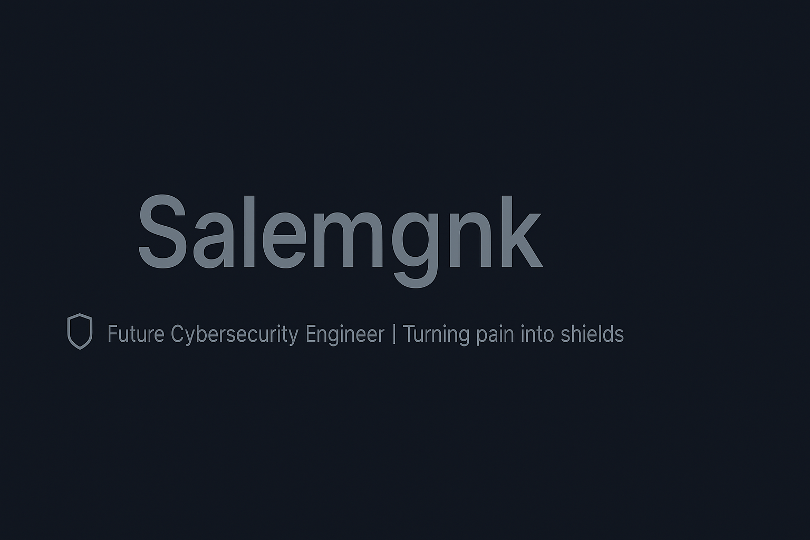

  

# 👋🏾 Hey, I'm Salem | 🛡️ Future Cybersecurity Engineer

## 🎯 Cybersecurity Enthusiast | 🛡️ Defense Strategist

> "I turn pain into code and shields."
---

### 🧰 Tech Stack:
- 🐍 Python | C / C++ / Bash  
- 💻 Linux: Fedora, Kali, Kubuntu, Ubuntu, Pop!_OS, Windows  
- ☁️ Cloud: Azure VMs (virtualization and networking practice)  
- 🌐 Web: React + Vite | Angular (learning)  
- 📚 Hobby: Reading, Writing, and Discovering new fields

---

### 🚧 Current Projects:
#### 🔍 [Melas Explorer](https://github.com/Salemgnk/melas_explorer)  
> A terminal-based file manager written in Python using ncurses  
> ✔️ Metadata view, color-coded files, basic file operations  
> ✔️ Dual-pane navigation with keyboard shortcuts

#### 🌅 [Quelques instants avant l’aube](https://poems-zeta.vercel.app/)  
> A React + Vite web app to share my poems and personal writings

#### 🧙‍♂️ EduQuest (on hold)  
> A gamified coding platform inspired by *Solo Leveling*  
> ⚔️ Cybersecurity quests | Frontend: Angular | Backend: Python

---

### 🎓 Education:
- 🎓 2nd-year student @ Epitech-Bénin (C++, cybersecurity specialization)  
- 🕸️ Former Network Assistant (OSPF, EIGRP, IPv6 tunneling - 6to4)  
- 🔐 Goal: Become a cybersecurity specialist skilled in auditing and system security

---

### 🤝 Collaboration:
- 🛠️ Open-source contributions to security-oriented educational projects  
- 🎯 Passionate about sharing knowledge and building innovative solutions

---

### 📫 Contact:
- 🐙 GitHub: [Salemgnk](https://github.com/Salemgnk)  
- 📬 Email: gnandisalem@gmail.com  
- 🐦 Twitter/X: [@Scorpi777d](https://twitter.com/Scorpi777d)

---

